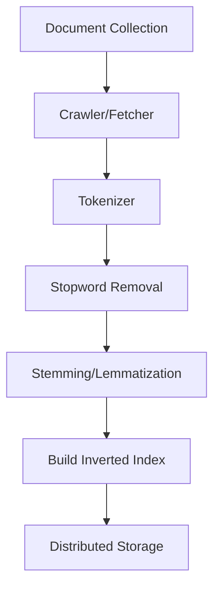
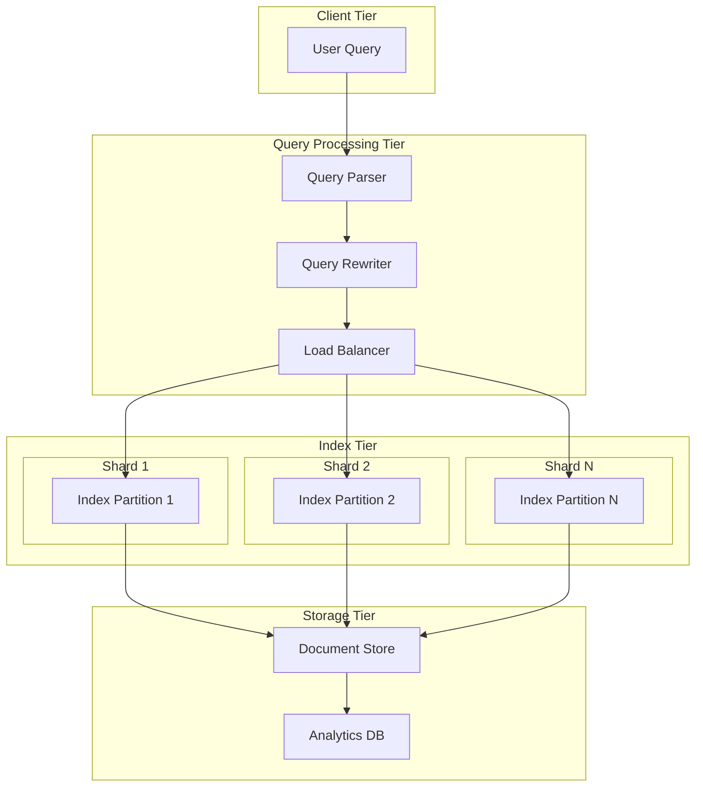
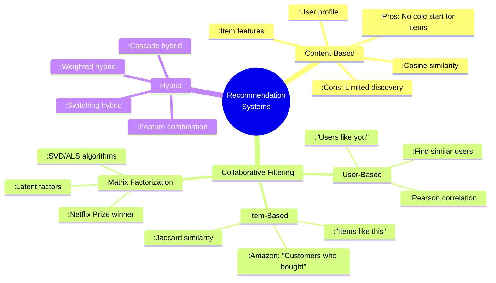

# ✅ **Day 9 Answers**

**Self-Test Answers:**
1. **Four key characteristics of WebSocket protocol:** Full-duplex communication, persistent connection, low latency, low overhead after handshake.
2. **Why scaling WebSockets is more complex than REST APIs:** WebSocket connections are stateful and persistent, requiring sticky sessions and shared connection state, unlike stateless HTTP.
3. **Purpose of a "connection registry":** Tracks which user is connected to which WebSocket server instance (user_id → server_id mapping) in a shared store like Redis.
4. **Two alternatives to WebSockets:**
    - **HTTP Long Polling:** Pro: Universal compatibility. Con: High latency/overhead.
    - **Server-Sent Events (SSE):** Pro: Efficient one-way server push. Con: No client-to-server communication.

---

# 🚀 **Day 10: Search & Recommendation Systems**

## 🎯 **Today's Mission**
Master how search engines find relevant results from billions of items and how recommendation systems predict what users will like.

## ⏰ **Daily Schedule (3 Hours)**

### **BLOCK 1: SEARCH ENGINE FUNDAMENTALS (60 minutes)**

#### **0-10 min: Warm-up**
Search seems simple: type query → get results. Behind the scenes:
- **Google:** Indexes ~130 trillion web pages, responds in ~0.5 seconds
- **Amazon:** Searches 350+ million products
- **Twitter:** Searches 500+ million tweets daily

**Key Problem:** Find relevant items in sub-second time from massive datasets.

#### **10-40 min: Inverted Index - The Heart of Search**

**What is an Inverted Index?**
A mapping from terms to the documents containing them (opposite of book index).

**Visualization:**
```
Documents:
1: "The cat sat on the mat"
2: "The dog sat on the log"

Forward Index (Document → Terms):
Doc1: [the, cat, sat, on, the, mat]
Doc2: [the, dog, sat, on, the, log]

Inverted Index (Term → Documents):
"cat": [1]
"dog": [2]  
"sat": [1, 2]
"mat": [1]
"log": [2]
"on": [1, 2]
"the": [1, 2]
```

**How Search Works with Inverted Index:**
```
Query: "cat on mat"

1. Lookup terms: "cat" → [1], "on" → [1,2], "mat" → [1]
2. Intersect results: [1] ∩ [1,2] ∩ [1] = [1]
3. Return document 1
```

**Building the Index - Process Diagram:**


#### **40-60 min: Ranking Algorithms - TF-IDF & BM25**

**TF-IDF (Term Frequency-Inverse Document Frequency):**
Measures how important a word is to a document in a collection.

**Formula:**
```
TF-IDF = TF(t,d) × IDF(t)

Where:
TF(t,d) = Frequency of term t in document d
IDF(t) = log(Total documents / Documents containing term t)
```

**Example Calculation:**
```
Total documents: 1000
Term "cat" appears 5 times in document A
Term "cat" appears in 10 documents total

TF("cat", A) = 5
IDF("cat") = log(1000/10) = log(100) = 2
TF-IDF = 5 × 2 = 10
```

**BM25 (Better than TF-IDF):**
Advanced ranking function used by modern search engines.

**Key Improvements over TF-IDF:**
1. **Document length normalization:** Penalizes long documents
2. **Saturation:** Term frequency has diminishing returns
3. **Tunable parameters:** k₁, b for fine-tuning

### **BLOCK 2: MODERN SEARCH ARCHITECTURE (45 minutes)**

#### **Distributed Search Architecture Diagram:**


#### **Components Explained:**

**1. Query Processing Pipeline:**
```
Raw Query → Tokenization → Stopword Removal → 
Stemming → Query Expansion → Search
```

**2. Index Sharding Strategies:**
- **Document-based sharding:** Split documents across shards
- **Term-based sharding:** Split vocabulary across shards
- **Hybrid:** Combine both approaches

**3. Real-time Indexing Challenge:**
How to handle updates without rebuilding entire index?

**Solution:** **Delta Index Approach**
```
Main Index (immutable, optimized for reads)
+
Delta Index (small, mutable, holds recent updates)
=
Current State

Periodically merge delta into main index
```

#### **Hands-on Exercise:** Design Twitter Search
```
Requirements:
- Search 500B tweets
- Latency: < 200ms
- Support: Keyword search, hashtag search, user search

Your Design:
1. Index by: content, hashtags, user_id, timestamp
2. Sharding: By tweet timestamp range (e.g., monthly shards)
3. Ranking: Recency boosted (newer tweets rank higher)
4. Caching: Popular search queries
```

### **BLOCK 3: RECOMMENDATION SYSTEMS (45 minutes)**

#### **Recommendation System Types:**


#### **Collaborative Filtering Deep Dive:**

**User-Item Matrix:**
```
        Item1  Item2  Item3  Item4
User1    5      3      ?      1
User2    4      ?      2      ?
User3    ?      1      4      5
User4    2      5      3      ?
```

**Problem:** Fill in the "?" (missing ratings)

**User-Based CF Approach:**
1. Find users similar to target user
2. Weight their ratings by similarity
3. Predict missing ratings

**Matrix Factorization (Netflix Prize Winner):**
Decomposes user-item matrix into latent factors:
```
R ≈ P × Qᵀ

Where:
R: User-Item matrix (m × n)
P: User-Factor matrix (m × k)  
Q: Item-Factor matrix (n × k)
k: Number of latent factors (typically 20-200)
```

#### **Real-world Example: Netflix Recommendations**
```
Pipeline:
1. Candidate Generation:
   - For user: Top 1000 videos from each algorithm
   - Algorithms: Trending, Top picks for you, Because you watched X
   
2. Ranking:
   - Machine learning model ranks 1000 → 100
   - Features: User history, video metadata, context
   
3. Diversity & Business Rules:
   - Ensure genre mix
   - Promote new content
   - Regional restrictions
```

### **BLOCK 4: INTERVIEW FOCUS (30 minutes)**

#### **Common Questions & Answers:**

**1. "How would you design Twitter's search?"**
```
Architecture:
1. Indexing Pipeline:
   - Tweets stream to Kafka
   - Indexers consume, build inverted index
   - Index sharded by timestamp (weekly/monthly)
   
2. Query Path:
   - Query → Query parser → Query rewriter
   - Fan out to relevant shards (based on time filter)
   - Merge results → Ranking → Return
   
3. Ranking Factors:
   - Relevance (TF-IDF/BM25)
   - Recency (newer tweets rank higher)
   - Social signals (likes, retweets)
   - User relationship (follows, interactions)
   
4. Scaling:
   - Hot shards for recent tweets (more replicas)
   - Caching popular searches
   - CDN for media in tweets
```

**2. "Explain the cold start problem in recommendations"**
```
Cold Start: No historical data for new users/items

Solutions:
For New Users:
1. Ask for preferences explicitly
2. Use demographic information
3. Show popular/trending items
4. Use session-based recommendations

For New Items:
1. Content-based filtering (use item metadata)
2. Hybrid approach (mix with collaborative)
3. Initial promotion to diverse user segments
4. Use item embeddings from descriptions

Example: Spotify asks new users to select favorite artists.
```

**3. "How do you evaluate search/recommendation quality?"**
```
Search Metrics:
1. Precision@K: % of top K results that are relevant
2. Recall@K: % of all relevant items in top K
3. MAP (Mean Average Precision): For multiple queries
4. NDCG (Normalized Discounted Cumulative Gain): Accounts for ranking position

Recommendation Metrics:
1. Click-Through Rate (CTR)
2. Conversion Rate
3. Mean Reciprocal Rank (MRR)
4. A/B testing: Compare algorithms in production

Business Metrics:
- User engagement
- Time spent
- Retention rate
- Revenue impact
```

#### **Whiteboard Practice:** Design Amazon Product Search
```
Components:
1. Query Understanding:
   - Spell correction
   - Synonym expansion ("laptop" → "notebook")
   - Intent classification (navigational vs. transactional)
   
2. Multi-faceted Search:
   - Keyword search
   - Category filter
   - Price range
   - Brand filter
   - Rating filter
   
3. Ranking:
   - Relevance score
   - Sales rank
   - Customer reviews
   - Profit margin (business rule)
   - Promotional boost
   
4. Personalization:
   - Purchase history
   - Browsing behavior
   - "Customers like you" recommendations
```

#### **Estimation Practice:**
```
Google Search Scale:
- Index: 130 trillion pages
- Average page size: 2MB
- Total index size: 130T × 2MB = 260 exabytes
- Compression (10:1): 26 exabytes
- Storage cost: ~$1B/month

Twitter Search Scale:
- Tweets: 500B
- Avg tweet: 300 bytes + metadata = 1KB
- Index size: 500B × 1KB = 500TB
- Shards: 100 shards = 5TB/shard
- Query rate: 10M searches/day = 115 searches/sec
```

---

## 📝 **DAY 10 OUTPUT REQUIRED**

**Complete in your notebook:**

1. **Search vs Recommendation Comparison Table:**
```
| Aspect          | Search Systems               | Recommendation Systems      |
|-----------------|------------------------------|----------------------------|
| User Intent     | Explicit (query)             | Implicit (discovery)       |
| Input           | Query string                 | User history, context      |
| Output          | Ranked list of items         | Personalized suggestions   |
| Key Algorithm   | Inverted Index, BM25         | Collaborative Filtering    |
| Evaluation      | Precision, Recall            | CTR, Engagement            |
| Example         | Google, Amazon Search        | Netflix, Spotify Discover  |
```

2. **Inverted Index Construction Diagram:**
   Draw the complete flow from documents to distributed index shards, including:
    - Tokenization
    - Stopword removal
    - Stemming
    - Index building
    - Sharding strategy

3. **Recommendation System Architecture:**
   Design a hybrid recommendation system showing:
    - Data collection (user interactions, item metadata)
    - Feature engineering
    - Multiple algorithms (content-based, collaborative filtering)
    - Ranking layer
    - A/B testing framework

4. **Flashcards Created:**
    - Front: **Inverted Index**
    - Back: Mapping from terms to documents containing them. Core of search engines. Enables fast lookup: O(1) for term→documents.

    - Front: **Collaborative Filtering Types**
    - Back: User-based (find similar users), Item-based (find similar items), Matrix Factorization (latent factors).

    - Front: **Cold Start Problem**
    - Back: No historical data for new users/items. Solutions: Ask preferences, use metadata, show popular items.

---

## 🧪 **Day 10 Self-Test**

**Answer without looking:**
1. What is an inverted index and why is it efficient for search?
2. What are the three main types of recommendation systems?
3. How does BM25 improve upon TF-IDF?
4. What is the cold start problem and two solutions?

**Answers:**
1. Inverted index maps terms to documents containing them. Efficient because: O(1) lookup for terms, easy intersection of results, compressible.
2. Content-based (item features), Collaborative Filtering (user behavior), Hybrid (combine both).
3. BM25 adds document length normalization, term frequency saturation, and tunable parameters for better ranking accuracy.
4. Cold start: No data for new users/items. Solutions: Ask for preferences (users), use content features (items), show popular items initially.

---

## 🚀 **Day 11 Preview: FAULT TOLERANCE & OBSERVABILITY**

**Preparation Thought:**
- Systems fail. How do we design them to fail gracefully?
- How do we know when something is broken before users complain?
- Think: Netflix streaming during AWS outage, Google's global redundancy

---

## 💪 **Accountability Check**

**Reply with:**
1. ✅ I've completed Day 10
2. 🔍 Most surprising thing about search algorithms: _____
3. 🎯 Recommendation system you use daily: _____
4. ❓ Question about search or recommendations: _____

**Remember:** Search helps users find what they want; recommendations help users discover what they might want. Both are critical for modern applications!