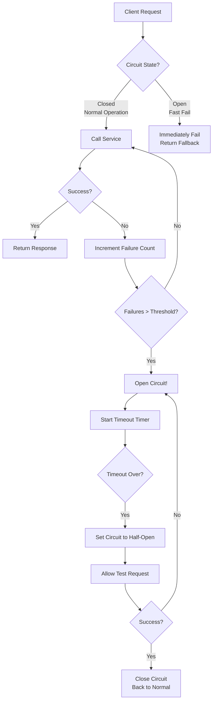
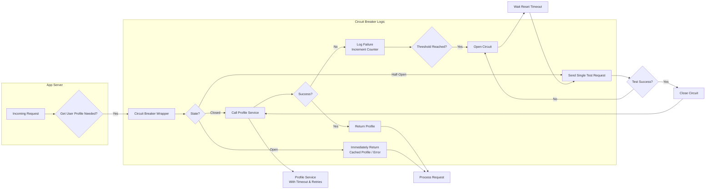
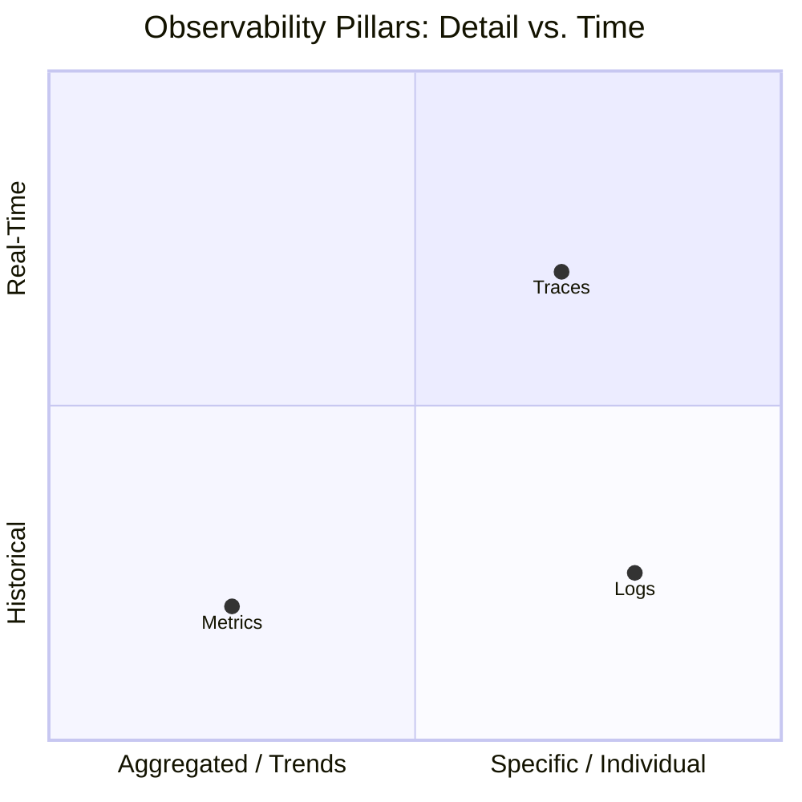
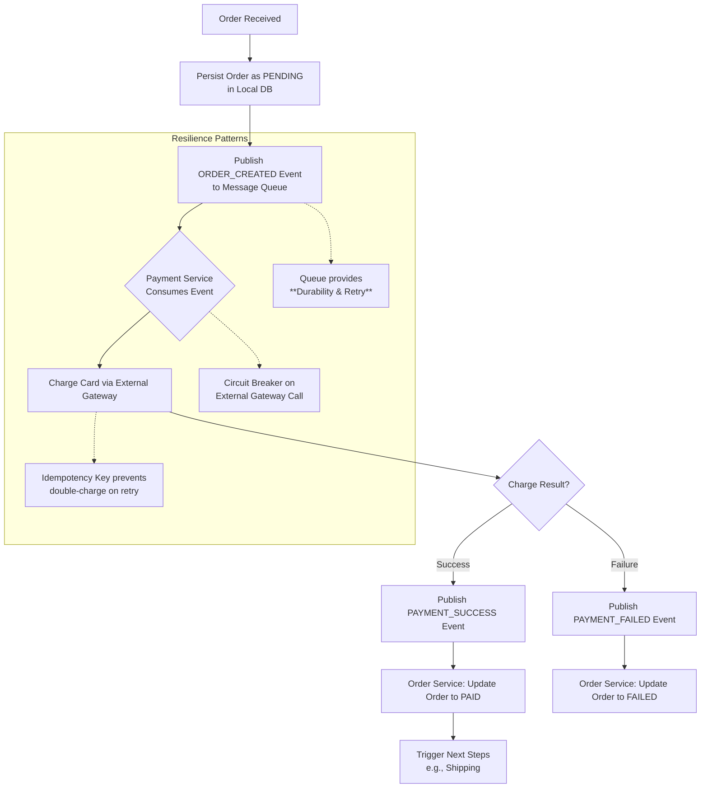

# 🔍 **Day 10 Answers: Making Search & Recommendations Stick**

Here are the answers with memorable analogies to help you retain them long-term.

## 🧪 **Day 10 Self-Test Answers with Memory Hooks**

**1. What is an inverted index and why is it efficient for search?**
> **Answer**: An inverted index is a **mapping from terms to the documents containing them** (like a book's index at the back, which lists words and their page numbers, rather than a table of contents which lists pages and their topics).

> **Memory Hook**: Think of a **library catalog**. A forward index is like browsing the shelves book-by-book to find ones about "cats." An inverted index is like going to the catalog, looking up "cats," and instantly getting a list of all books that mention cats. It's efficient because it's a **O(1) dictionary lookup** for terms, followed by fast set intersections.

**2. What are the three main types of recommendation systems?**
> **Answer**:
> 1.  **Content-Based**: "This is like other things you've liked." It recommends based on **item features** (genre, actor, keywords).
> 2.  **Collaborative Filtering (CF)**: "People like you liked this." It recommends based on **user behavior patterns**.
> 3.  **Hybrid**: Combines both of the above for better results.

> **Memory Hook**: Imagine a **music store clerk**.
> *   **Content-Based** is a clerk who only knows the music's "DNA" (genre, instruments). If you buy a rock album, they'll show you other rock albums.
> *   **Collaborative Filtering** is a clerk who ignores the music's details but watches all customers. If they see five people who bought the same album as you *also* bought another album, they'll recommend that one.
> *   **Hybrid** is the smart clerk who does both.

**3. How does BM25 improve upon TF-IDF?**
> **Answer**: BM25 introduces **document length normalization** (penalizing very long documents that can artificially boost term frequency) and **term frequency saturation** (recognizing that appearing 20 times isn't 20x more relevant than appearing once). It's a more realistic, tunable probabilistic model.

> **Memory Hook**: **TF-IDF is like counting how many times a keyword appears in an essay**. A very long essay can win just by being wordy. **BM25 is like a teacher grading that essay**—they consider if the keyword is truly central to the argument (saturation) and discount the score if the essay is rambling and unfocused (length normalization).

**4. What is the cold start problem and two solutions?**
> **Answer**: The "cold start" is having **no historical data for new users or new items**, making personalized recommendations impossible.
> *   **For a new user**: Ask for explicit preferences, use demographic info, or show trending/popular items.
> *   **For a new item**: Use its content/metadata (content-based filtering) or aggressively promote it to a small, diverse test group.

> **Memory Hook**: It's like being a **new student in a school** (cold start for a user). The teacher doesn't know you. Solutions: They can **ask you what you like** (explicit preferences) or **pair you with popular kids first** (show trending items). A **new book in the library** (cold start for an item) can be placed on a "new arrivals" display (promotion) or recommended to those who like its genre (content-based).

---

# 🚨 **Day 11: Fault Tolerance & Observability**

## 🎯 **Today's Mission**
Learn to build systems that **fail gracefully** and **tell you they're sick** before they die. This is what separates hobby projects from production-grade systems at FAANG.

## ⏰ **Daily Schedule (3 Hours)**

### **BLOCK 1: FAULT TOLERANCE PATTERNS (60 min)**

#### **0-10 min: Warm-up - Embracing Failure**
> **Key Mindshift**: Hardware fails. Networks partition. Software has bugs. **Failure is not an "if" but a "when."** Fault tolerance is designing your system to expect and handle these failures automatically.

**The Three Pillars of Resilience**:
1.  **Prevention**: Try to stop faults (testing, code reviews).
2.  **Tolerance**: Accept that faults will happen and handle them (today's focus).
3.  **Recovery**: Fix things after they break (backups, rollbacks).

---

#### **10-40 min: Core Patterns with Mental Models**

Let's visualize the core patterns. A "service" can be a database, an internal API, or a dependency like a payment gateway.

**1. Circuit Breaker Pattern**
*   **What it is**: An automatic switch that **stops calling a failing service**, just like an electrical circuit breaker stops current flow to prevent fire.
*   **The Three States (MEMORIZE THIS)**:
    *   **CLOSED**: Everything's fine. Requests flow through normally.
    *   **OPEN**: The service is failing. **All requests immediately fail fast** (no waiting for timeouts). Returns a fallback or error.
    *   **HALF-OPEN**: After a timeout, let one test request through. If it succeeds, go back to CLOSED. If it fails, go back to OPEN.
*   **Memory Hook**: Think of a **damaged bridge (the service)**. The circuit breaker is the police barricade.
    *   **CLOSED**: Bridge is open, traffic flows.
    *   **OPEN**: Bridge is cracked! Police (circuit breaker) block all cars (requests) immediately, redirecting them (fallback).
    *   **HALF-OPEN**: Engineers send one test vehicle. If it crosses, they reopen the bridge (CLOSED). If it falls through, they keep it barricaded (OPEN).

**2. Retry Pattern with Exponential Backoff**
*   **The Problem**: A transient failure (network blip) might succeed if retried. But retrying immediately in a loop can overwhelm the failing service.
*   **The Solution**: Wait longer between each retry (e.g., 1s, 2s, 4s, 8s...).
*   **Memory Hook**: It's like **knocking on a friend's door**. If they don't answer, you wait a bit longer each time before knocking again, instead of pounding incessantly and annoying them (overloading the service).

**3. Bulkhead Pattern**
*   **What it is**: **Isolate failures** in one part of the system from bringing down everything else, like watertight compartments in a ship.
*   **How**: Use separate **thread pools, connection pools, or even services** for different operations.
*   **Memory Hook**: In a **restaurant kitchen**, if the fryer catches fire (failure in the "fries" component), the fire doors (bulkheads) contain the blaze. The grill station (another component) can keep making burgers, and the whole kitchen doesn't have to evacuate.

---

#### **40-60 min: Putting It All Together - The "User Profile" Service**

Imagine a service that fails under load. Let's protect it.

**How it works in an interview**:
1.  **Client** calls your app to load a page.
2.  **Your App** needs user data from the Profile Service.
3.  **Circuit Breaker** checks: Is the circuit for Profile Service OPEN? If yes, **immediately** return cached data or a friendly error. Don't even try.
4.  If CLOSED, it calls the service **with a Timeout** (e.g., 2 seconds).
5.  If the call fails or times out, it records the failure.
6.  After **5 failures in a row**, it TRIPS the circuit to OPEN.
7.  Now, all subsequent requests fail fast for the next **30 seconds** (protecting the failing service).
8.  After 30s, it goes to HALF-OPEN, lets one test request through, and decides what to do next.

### **BLOCK 2: OBSERVABILITY - THE THREE PILLARS (45 min)**

Observability is how you understand what's happening inside your system. You cannot fix what you cannot see.

#### **The Three Pillars Visualized**

**1. Metrics - The Vital Signs**
*   **What**: Numerical measurements aggregated over time (e.g., requests per second, error rate, CPU usage).
*   **Memory Hook**: Your system's **dashboard gauges**. You don't record every engine explosion (log), but you watch the RPM, temperature, and fuel level (metrics) to see if something's wrong.
*   **The ** **: Rate, Errors, Duration, and Saturation.**
    *   **Rate**: How many requests per second?
    *   **Errors**: What percentage are failing?
    *   **Duration**: How long do requests take? (p95, p99)
    *   **Saturation**: How full is your queue? (Memory, CPU, I/O).

**2. Logs - The Black Box Recorder**
*   **What**: Timestamped, unstructured or semi-structured text events describing what happened (e.g., `ERROR: Failed to connect to DB at 10:05:01`).
*   **Memory Hook**: The **ship's logbook** or an **airplane's black box**. It's the discrete, detailed record of events, crucial for debugging the *why* after you see a problem in the metrics.
*   **Key**: Log at appropriate levels (DEBUG, INFO, WARN, ERROR) and structure them (JSON) for easy querying.

**3. Distributed Tracing - The Request's Journey Map**
*   **What**: Follows a **single request** as it flows through all your microservices, showing timing and dependencies.
*   **Memory Hook**: A **package tracking number**. You can see the package (request) leave the warehouse (user), arrive at the sorting facility (API Gateway), sit on a truck (Queue), and finally get delivered (Database). If it's late, you see exactly which leg caused the delay.

#### **Hands-on: Debugging a Slow Request**
**Scenario**: The "Checkout" API is slow (high p99 duration metric).
1.  **Check Metrics Dashboard**: Confirm the spike in duration. See if errors or saturation also spiked.
2.  **Examine Logs**: Filter logs for `checkout` around the spike time. Look for WARN/ERROR messages like "timeout connecting to payment service."
3.  **Analyze Traces**: Pull traces for slow checkout requests. The **trace graph will visually show you** that 90% of the time was spent in the "Payment Service," and within that, it was stuck on a call to "Fraud Detection API."
4.  **Root Cause**: You've identified the failing dependency without guessing.

### **BLOCK 3: REAL-WORLD RESILIENCE (45 min)**

#### **Case Study: Netflix Chaos Monkey**
*   **What it is**: A tool that **randomly shuts down production instances** during business hours.
*   **Why**: To ensure engineers build services that are resilient to constant, expected failure. It forces the use of all patterns we just learned.
*   **The Lesson**: You can't claim to be fault-tolerant if you never test it. Resilience must be actively engineered.

#### **Designing a Resilient "Payment Processing" Flow**
Let's design a critical path that must not lose data or double-charge.

**Key Patterns in Action**:
1.  **Durability via Queue**: The order event is stored in Kafka. Even if the Payment Service crashes, it will re-read the event when it restarts.
2.  **Idempotency**: The payment request includes an `idempotency_key` (e.g., the order ID). If the Payment Service crashes *after* charging the card but before sending the success event, the retry with the same key will not create a second charge.
3.  **Circuit Breaker**: On the call to the external payment gateway.
4.  **Compensating Action**: The `PAYMENT_FAILED` event is a compensating action that rolls back the order state.

### **BLOCK 4: INTERVIEW FOCUS (30 min)**

#### **Common Questions & Answers:**

**1. "A service you depend on starts timing out. How do you handle it?"**
> **Answer**: I'd implement a **defense-in-depth strategy**:
> 1.  **Immediate mitigation**: Implement or tune a **Circuit Breaker** on the caller's side to fail fast and stop cascading failures.
> 2.  **User experience**: Use **fallback logic** (return stale cached data, a friendly message, or a degraded feature).
> 3.  **Visibility**: Ensure **metrics** (error rate, latency) and **alerts** are in place to detect the issue. Use **distributed tracing** to confirm the bottleneck is in the dependency.
> 4.  **Root cause & fix**: Coordinate with the dependency's team. Consider implementing **bulkheads** to isolate this failure from other critical functions.

**2. "How do you design a system to be observable from day one?"**
> **Answer**: I'd embed the **three pillars** into the design:
> 1.  **Metrics**: Define the key RED/S metrics for each service. Integrate a metrics library (Prometheus client) from the start.
> 2.  **Logging**: Establish standards: structured logging (JSON), consistent log levels, and a unique request/correlation ID passed through all services.
> 3.  **Tracing**: Integrate a tracing SDK (OpenTelemetry) to automatically instrument outbound calls. Ensure all services propagate trace headers.
> 4.  **Dashboards & Alerts**: Create a dashboard per service showing its health. Set up alerts on SLOs (e.g., "error budget burn rate").

**3. "Explain idempotency. Why is it critical for resilience?"**
> **Answer**: An operation is **idempotent** if performing it multiple times has the same effect as performing it once (e.g., `UPDATE user SET status='paid' WHERE id=123`).
> It's **critical for resilience** because in a distributed system with retries and failures, the same request may be processed more than once. Without idempotency, this causes **duplicate charges, double bookings, or incorrect state**. We achieve it using **idempotency keys** sent by the client, which the server uses to deduplicate requests.

#### **Whiteboard Practice: Design a Resilient File Upload Service**
> **Scenario**: Users upload large videos. The processing pipeline (transcode, thumbnail, store) is long and prone to failures.
>
> **Your whiteboard design should include**:
> 1.  **Durability**: The upload request is an event in a persistent queue (Kafka) as soon as the bytes are received.
> 2.  **Idempotency**: Use a client-provided `upload_id` to avoid creating duplicate videos if the client retries.
> 3.  **Retry & Backoff**: Each processing step (transcode) retries with exponential backoff.
> 4.  **Circuit Breaker**: On calls to external storage (S3) or the transcoding cluster.
> 5.  **Observability**: Metrics (upload success rate, processing duration), Logs (step completion/failure), Traces (follow one video through the entire pipeline).

---

## 📝 **DAY 11 OUTPUT REQUIRED**

**Complete in your notebook:**

1.  **Pattern Analogy Table**:
    *   Create a table mapping each fault tolerance pattern to a **real-world analogy** (like the bridge, doorbell, and ship bulkhead examples above). This is how you'll recall them in an interview.

2.  **Observability Decision Tree**:
    *   Draw a simple flowchart: "I have a problem X. Which pillar do I use?"
        *   **"Is the system slow/erroring right now?"** → **Metrics (Dashboard)**
        *   **"Why did this specific request fail at 2:05 AM?"** → **Logs**
        *   **"Where in the chain of 10 services is the latency spike happening?"** → **Distributed Tracing**

3.  **Resilience Checklist**:
    *   List the 5 key questions to ask when reviewing a new service design for resilience:
        1.  What happens when a **dependency fails**? (Circuit Breaker)
        2.  What happens when **this service crashes mid-operation**? (Idempotency, Durable Queue)
        3.  Can a failure here **cascade and take down other services**? (Bulkheads, Timeouts)
        4.  How do we **know** when it's failing? (Metrics/Alerts)
        5.  How do we **debug** why it failed? (Logs & Traces)

4.  **Flashcards**:
    *   **Front**: Three States of a Circuit Breaker
    *   **Back**: **Closed** (normal), **Open** (fail-fast), **Half-Open** (testing).
    *   **Front**: The Four Golden Signals of Metrics (RED/S)
    *   **Back**: **R**ate, **E**rrors, **D**uration, **S**aturation.

---

## 🧪 **Day 11 Self-Test**
**Answer using the memory hooks:**
1.  Your service calls a buggy database that hangs. What pattern **stops you from exhausting your threads waiting**? *(Hint: Police barricade)*
2.  You see error rates spiking on a dashboard. What do you check next to find the root cause? *(Hint: Three pillars)*
3.  A payment request might be sent twice due to a retry. What property must the payment operation have? *(Hint: Same effect, once or many times)*

*(Answers: 1. Circuit Breaker, 2. Logs & Distributed Traces for that time period, 3. Idempotency)*

---

## 🚀 **Day 12 Preview: Security & API Design**
**Preparation Thought**:
- How do you stop hackers without ruining the user experience?
- What's the difference between authentication and authorization?
- Think: How does your bank app keep your money safe while letting you pay easily?

Let me know when you've completed Day 11, and we'll move on to building secure systems! 🔒